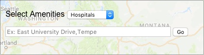
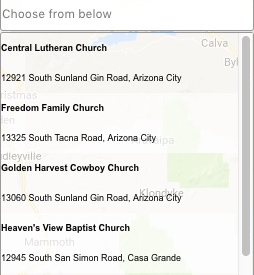
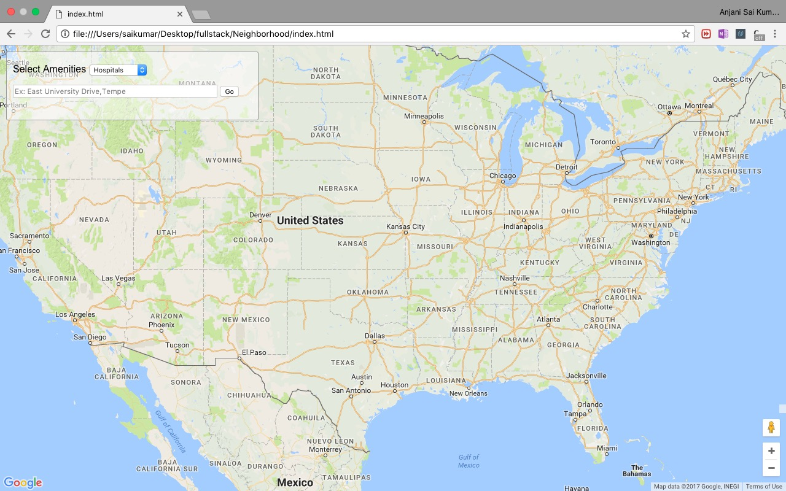
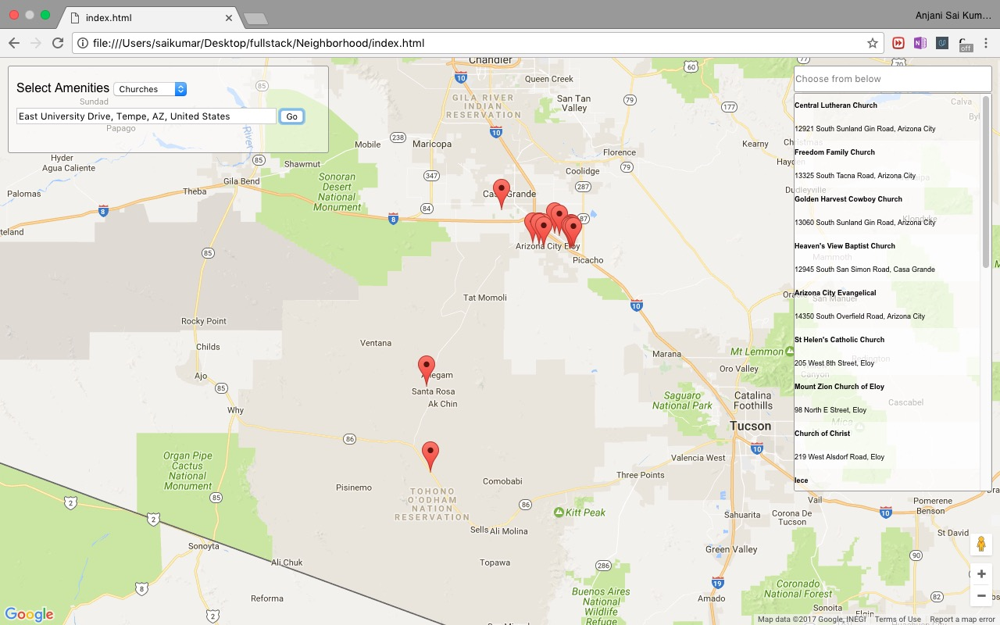
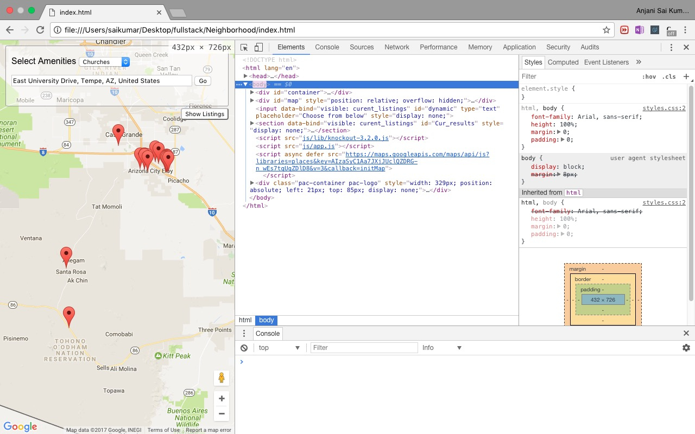
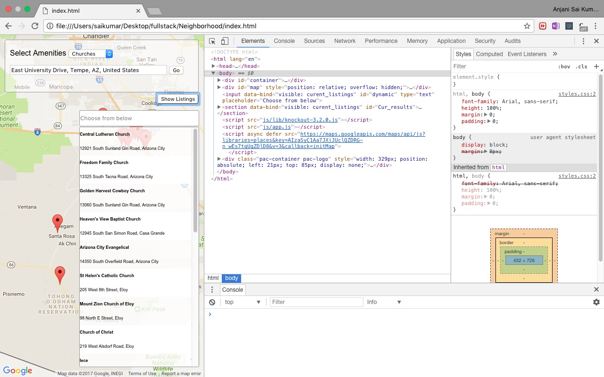

# Neighborhood Amenities

## Description

Helps the user to search for amenities in a neighborhood of interest.

##### Search for :
* Hospitals
* Groceries
* Gym
* Schools
* Restaurants
* Car Rentals
* Temples
* Mosques
* Churches

#### Instructions:
To open the app locally, just open the [*```index.html```*](index.html) file with any browser.

## Usage

The User inputs the neighborhood in the searchbox shown below



Upon the display of results from Search, user can filter among them using the below input Box



## Screenshots

* ##### Homepage and Results on Larger viewports





* ##### Homepage and Results on Smaller viewports




